# DeepAnalyze 部署教程

这份文档将引导你如何在本地部署 DeepAnalyze-8B 模型并启动完整的对话系统。

## 概述

DeepAnalyze 是一个自动化数据科学分析工具。本教程展示如何：
1. 启动后端 API 和前端界面
2. 下载并配置 DeepAnalyze-8B 模型
3. 通过 LM Studio 启动模型服务
4. 在浏览器中与 DeepAnalyze 进行交互

**⚠️ 重要提示：** 必须先启动服务（第一步），再去 LM Studio 中配置和加载模型（第二步及之后）。否则在启动服务时可能会杀掉模型的进程，导致部署失败！

**注意：** 本教程中的截图展示的是核心流程的关键步骤，不一定是完全按顺序截取的，但都是部署过程中会遇到的重要界面。

---

## 第一步：启动完整服务系统

### ⚠️ 这是最重要的一步！必须先做！

在配置 LM Studio 模型之前，你需要先启动后端服务和前端界面。这样可以避免启动时的进程冲突。

### 1.1 进入项目目录并激活环境

打开终端，进入 DeepAnalyze 项目的 `demo` 文件夹：

```bash
# 激活 conda 环境
conda activate deepanalyze

# 进入 demo 目录
cd ~/Downloads/DeepAnalyze/demo

# 启动所有服务
sh start.sh
```

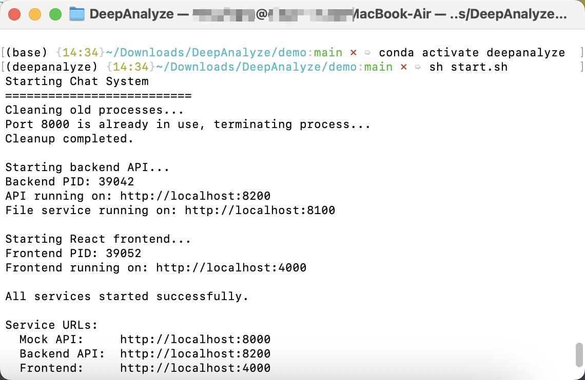

**启动输出说明：**

```
Starting Chat System
===========================
Cleaning old processes...
Port 8000 is already in use, terminating process...
Cleanup completed.

Starting backend API...
Backend PID: 39042
API running on: http://localhost:8200
File service running on: http://localhost:8100

Starting React frontend...
Frontend PID: 39052
Frontend running on: http://localhost:4000

All services started successfully.

Service URLs:
  Mock API:     http://localhost:8000    ← LM Studio 服务
  Backend API:  http://localhost:8200    ← 后端 API
  Frontend:     http://localhost:4000    ← 用户界面
```

**各服务说明：**
| 服务 | 端口 | 用途 |
|------|------|------|
| LM Studio | 8000 | 模型推理服务 |
| Backend API | 8200 | 后端应用接口 |
| File Service | 8100 | 文件上传下载服务 |
| Frontend | 4000 | 前端用户界面 |

### 1.2 常见启动错误与解决方案

启动时可能会遇到一些 Python 模块缺失的错误。这些是正常的，按照错误提示安装对应的包即可。

**常见错误示例：**

#### 错误 1：缺少 `fastapi` 模块
```
ModuleNotFoundError: No module named 'fastapi'
```
**解决方案：**

```bash
pip install fastapi uvicorn
```

#### 错误 2：缺少 `transformers` 模块
```
ModuleNotFoundError: No module named 'transformers'
```
**解决方案：**

```bash
pip install transformers
```

**一般规则：** 如果启动脚本报错说缺少某个模块，直接运行：
```bash
pip install <模块名>
```

例如，如果显示缺少 `PIL`，就运行 `pip install Pillow`（PIL 的包名是 Pillow）。

### 1.3 验证服务启动成功

启动成功后，你应该看到：
- ✅ 三个 PID 信息（Backend PID、Frontend PID）
- ✅ 所有服务 URL 已列出
- ✅ 消息"All services started successfully"

如果启动成功，保持这个终端窗口打开，然后进行第二步。

---

## 第二步：验证服务状态

### 2.1 检查服务日志

启动成功后，你可以在 `demo/logs/` 目录中查看各个服务的日志文件。

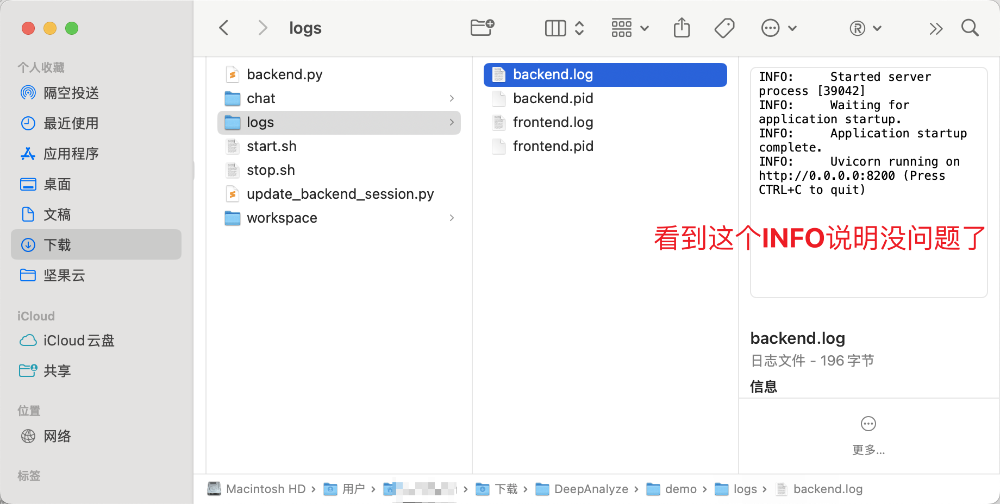

**日志文件说明：**
- `backend.log`: 后端 API 的运行日志
- `backend.pid`: 后端进程 ID
- `frontend.log`: 前端应用的运行日志
- `frontend.pid`: 前端进程 ID

**正常启动日志示例：**
```
INFO:     Started server process [39042]
INFO:     Waiting for application startup.
INFO:     Application startup complete.
INFO:     Uvicorn running on http://0.0.0.0:8200
```

---

## 第三步：准备 LM Studio 环境

现在可以开始配置 LM Studio 了。确保服务已在第一步成功启动。

### 3.1 打开 LM Studio 并进入开发模式

首先启动 LM Studio 应用。在右下角点击设置图标，进入应用设置。


**具体操作：**
- 点击右下角的设置图标 ①
- 进入设置菜单后，点击"Settings"标签 ②
- 在左侧菜单找到"General"选项 ③
- 将语言切换为中文（简体中文 Beta）④

### 3.2 切换语言后返回主界面

切换完语言后，返回主界面。你需要手动点击顶部的"选择要加载的模型"按钮来搜索模型。

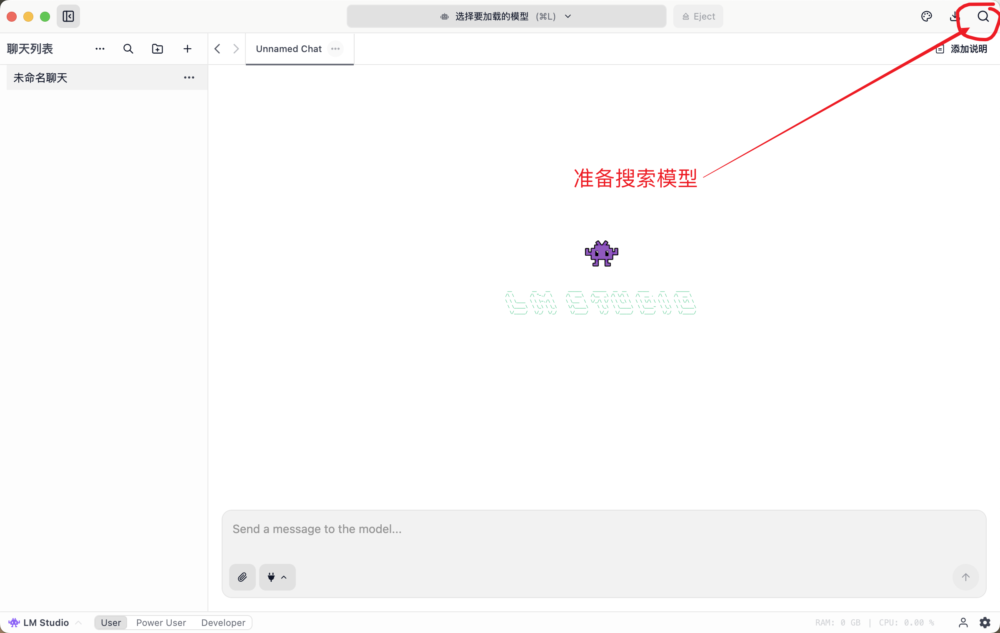

---

## 第四步：下载 DeepAnalyze-8B 模型

### 4.1 搜索并选择模型

点击顶部的"选择要加载的模型"按钮，搜索框中输入 **deepanalyze-8b**。

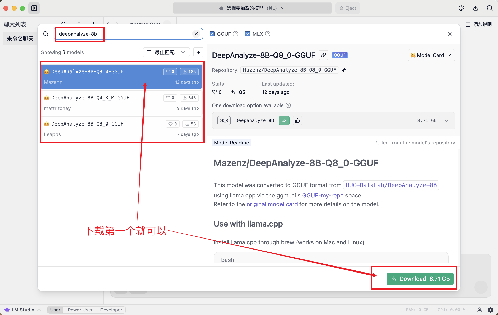

**模型选择：**
- 在搜索框中输入 `deepanalyze-8b`
- 选择第一个结果：**DeepAnalyze-8B-Q8_0-GGUF**（来自 Mazenz）
- 这是量化版本，大小为 8.71 GB，适合在本地运行
- 点击下方的绿色"Download"按钮开始下载 ✓

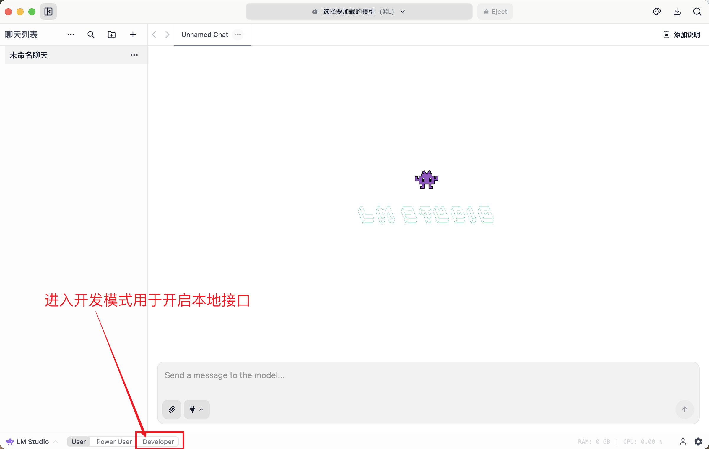

**注意：** 模型文件较大（8.71 GB），下载时间取决于网络速度。请耐心等待。

### 4.2 进入开发模式

下载过程中，需要进入开发模式来启动本地服务接口。点击左下角的设置 > 选择 **Developer** 模式。


---

## 第五步：配置 LM Studio 服务器

### 5.1 打开服务器设置

模型下载完成后，点击 **Server Settings** 按钮配置服务器参数。

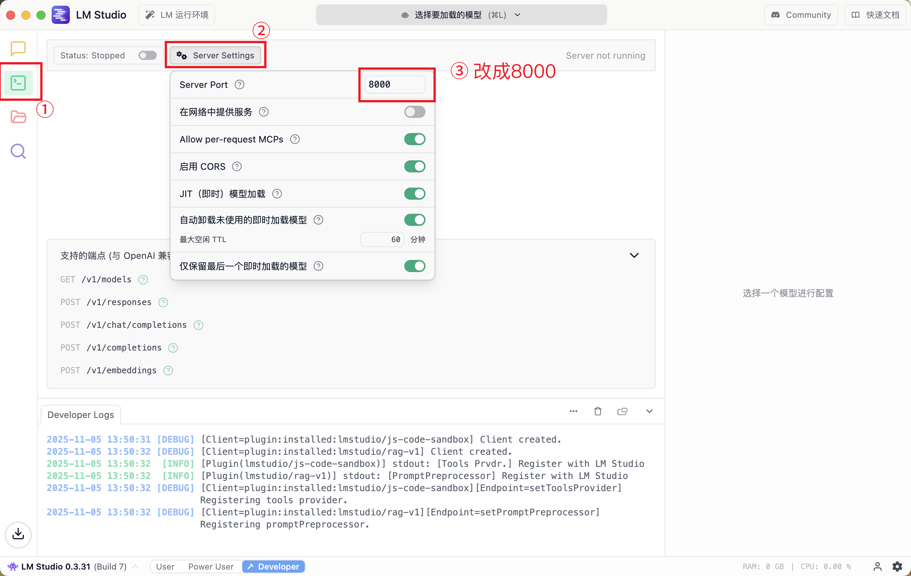

**配置步骤：**
- 点击左侧的服务器管理图标 ①
- 点击"Server Settings"按钮 ②
- **关键设置**：将 **Server Port** 从默认的 **1234** 改成 **8000** ③

其他配置保持默认即可：
- Allow per-request MCPs: ✓ (已启用)
- Enable CORS: ✓ (已启用)
- JIT (即时) 模型加载: ✓ (已启用)

### 5.2 启动服务器

完成配置后，点击启动按钮启动 LM Studio 服务器。

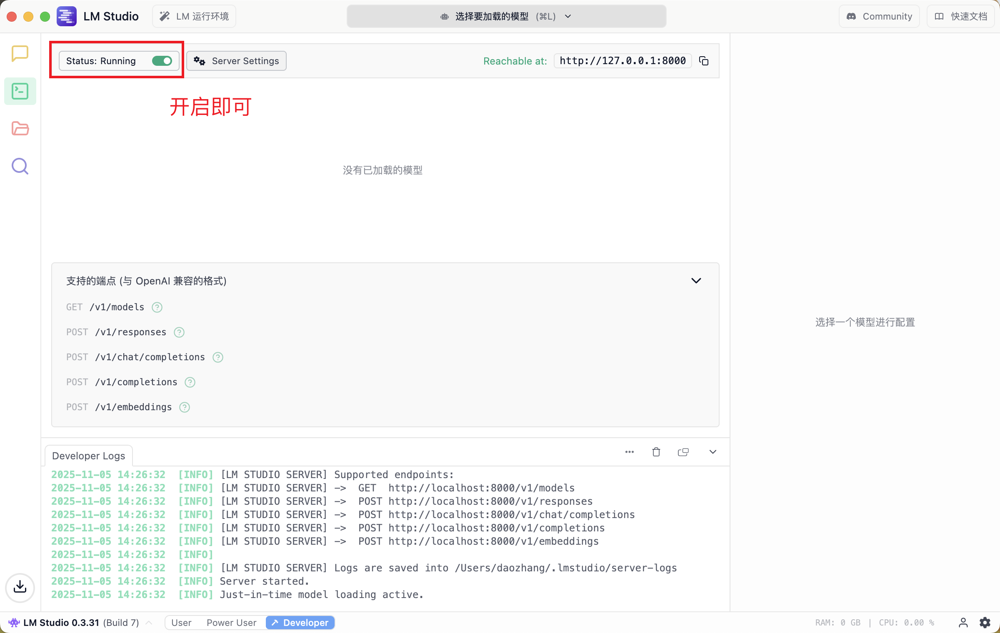

**启动状态：**
- 当你看到 **Status: Running** 和绿色开关时，说明服务器已成功启动 ✓
- 可达地址：`http://127.0.0.1:8000`

---

## 第六步：模型加载与准备

### 6.1 模型加载状态

点击"选择要加载的模型"按钮，选择已下载的 **DeepAnalyze-8B** 模型进行加载。

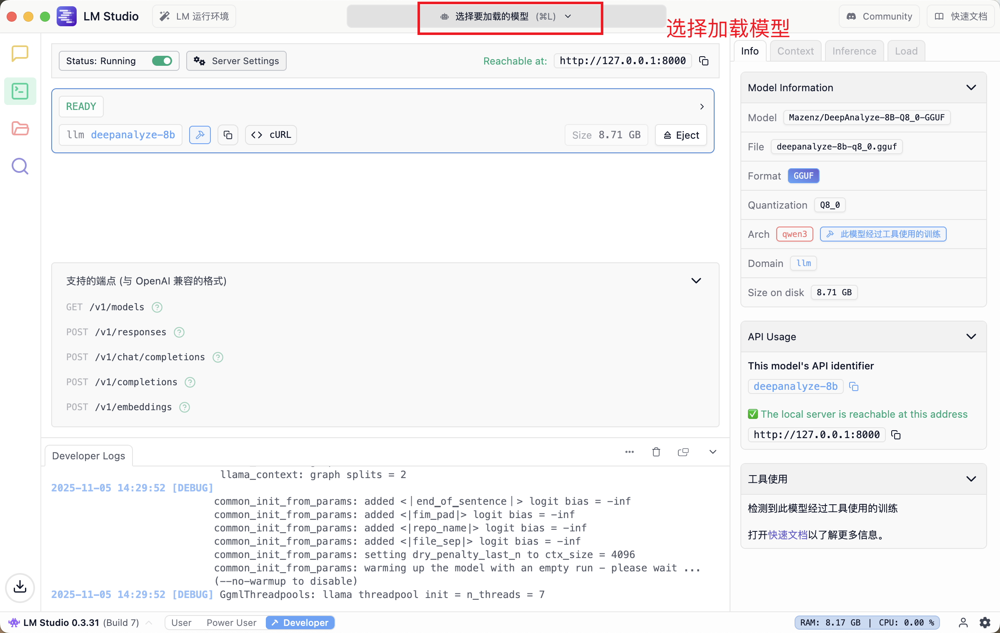

**加载完成标志：**
- 当模型状态显示为 **READY** 时，说明模型已加载完毕
- 可以看到模型信息面板：
  - 模型名称：`Mazenz/DeepAnalyze-8B-Q8_0-GGUF`
  - 文件格式：GGUF
  - 量化版本：8_0
  - 磁盘大小：8.71 GB

### 6.2 模型加载中

如果看到加载进度条，表示模型正在加载。

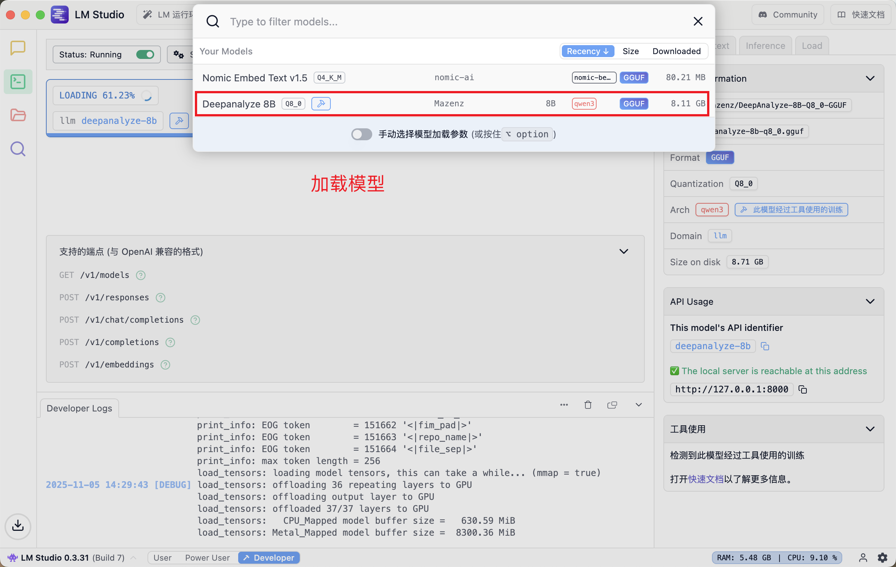

**加载进度：**
- 系统正在将模型张量加载到内存中
- 这个过程可能需要几分钟，取决于你的硬件配置
- 继续等待至加载完成（显示 READY）

---

## 第七步：访问 DeepAnalyze 界面

### 7.1 打开浏览器访问前端

所有服务启动完成后，打开浏览器并访问：

```
http://localhost:4000
```

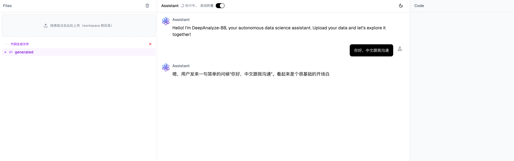

**界面功能：**
- 点击"+"按钮可以创建新对话
- 文件上传区域：拖拽或点击上传数据文件
- DeepAnalyze-8B 助手会自动识别并分析你的数据

### 7.2 与 DeepAnalyze 交互

上传数据后，你可以向 DeepAnalyze 提出任何数据分析问题。

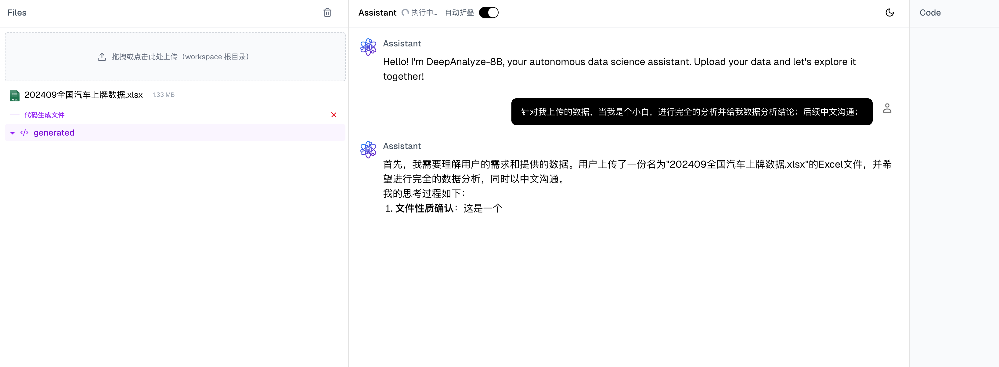

**使用示例：**
- 上传 Excel 或 CSV 文件
- 输入分析需求：例如"请分析这份数据并生成报告"
- DeepAnalyze 会自动：
  1. 理解数据结构
  2. 进行数据清洗和分析
  3. 生成数据可视化
  4. 输出分析报告
